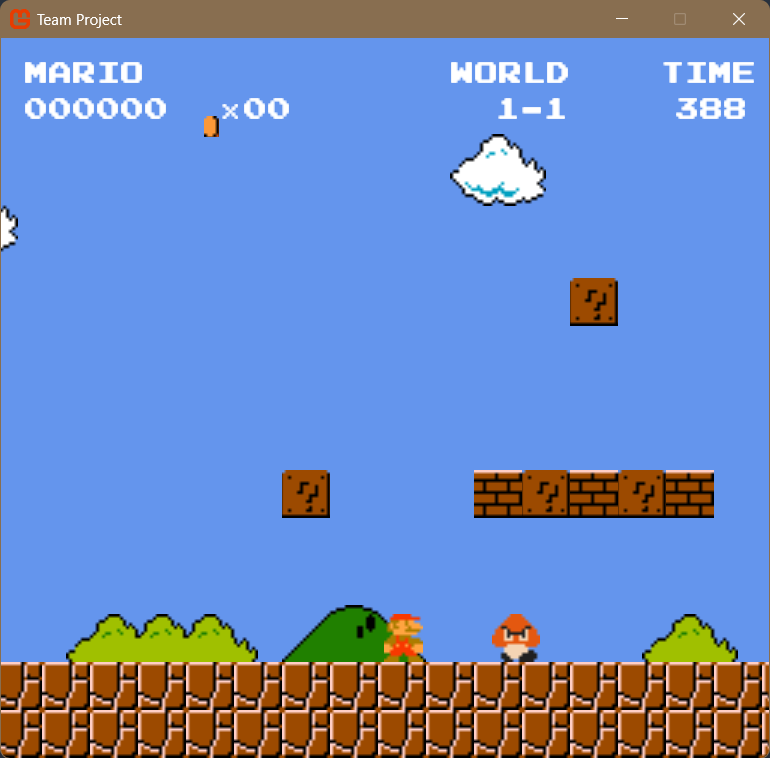

# Visual Stud-ios

## Super Mario Bros. World 1-1 Recreation

A recreation of the first level of **Super Mario Bros.** developed as a four-person software engineering team project using C# and Microsoft XNA.

This project focused on applying object-oriented programming principles, game architecture concepts, real-time systems design, and collaborative software development practices.

---

# Project Overview

The goal of this project was to recreate the gameplay experience of the original Super Mario Bros. World 1-1 while building the underlying systems from scratch.

The project includes:

- Player movement and controls
- Collision detection
- Physics and gravity systems
- Enemy behavior
- Sprite rendering
- Animation systems
- Game states
- HUD elements
- Level management
- XML-based content handling

---

# Technologies

| Category                | Technologies                                |
|-------------------------|---------------------------------------------|
| Language                | C#                                          |
| Additional Languages    | C++, XML                                    |
| Framework               | Microsoft XNA                               |
| Development Environment | Visual Studio                               |
| Version Control         | Team Foundation Version Control (TFVC), Git |

---

# My Contributions

**Role:** Developer (4-person team)

My primary contributions included:

## Gameplay Systems
- Player behavior and character implementation
- Input handling systems
- Gameplay state transitions
- Character-specific features

## User Interface
- HUD systems
- High score functionality
- Menu and screen systems

## Rendering and Assets
- Sprite management
- Animation integration
- Content pipeline organization

## Software Engineering Practices
- Code reviews
- Documentation
- Refactoring and debugging across multiple sprint milestones

---

# Development History

Originally developed using Microsoft Team Foundation Version Control (TFVC), this project was recovered and migrated into Git for portfolio preservation.

Original development history:
- 387 total team changesets
- 67 changesets authored by Ryan Pickett
- 420+ C# source files modified by Ryan Pickett

The recovered source history demonstrates iterative development through multiple software engineering sprints.

---

# Team

**Visual Stud-ios**

A four-person software engineering team that developed this project as part of undergraduate coursework.

---

# Future Improvements
- Modernize XNA framework dependencies
- Improve documentation

\- Add gameplay screenshots and technical diagrams

\- Continue modernization for current platforms

